##はじめに

Okinawa.rb の発起人である @yasulab さんが中心となって、沖縄初の「沖縄Ruby会議01」が開催されました。

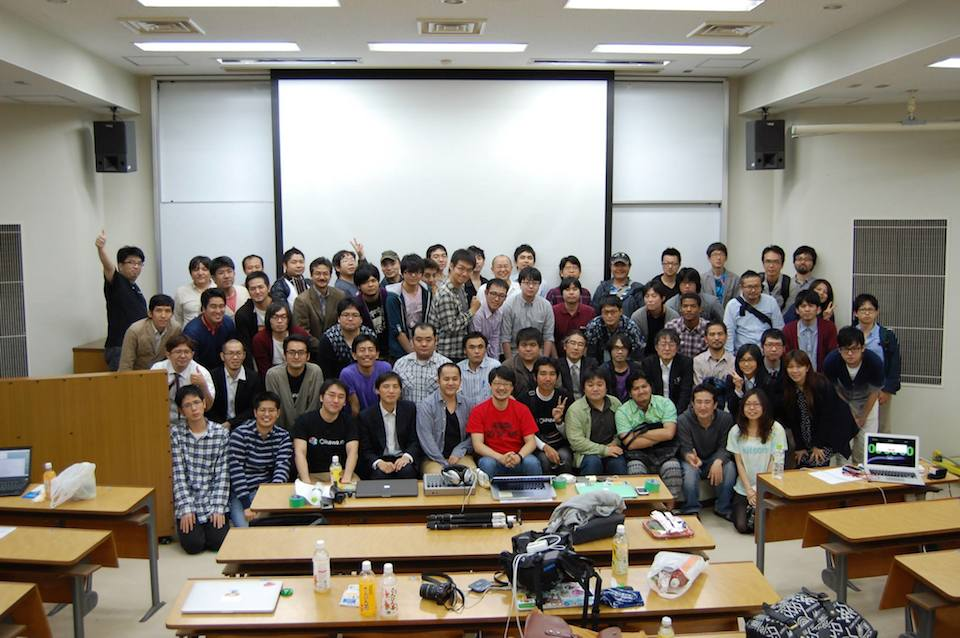

## 開催日

2013年3月1日 13:00-18:00

## 開催場所

琉球大学 工学部１号館 大教室 322 (本会場) & 321 (サテライト会場)


## 主催


## 協力

日本Rubyの会、ギークハウス沖縄、株式会社レキサス、特定非営利活動法人軽量Rubyフォーラム、ウェブペイ株式会社

## 公式タグ・Twitter

\#okrk01

* [沖縄Ruby会議のtweetまとめ](http://togetter.com/li/636273)

## ゲスト講演1

* 動画
  * [ゲスト講演 「Change your world」](http://www.ustream.tv/recorded/44345761)

  ※12:33ぐらいから始まります。

### Change Your World

* 発表者
    * [@yukihiro_matz](https://twitter.com/yukihiro_matz)
* 資料
   * なし

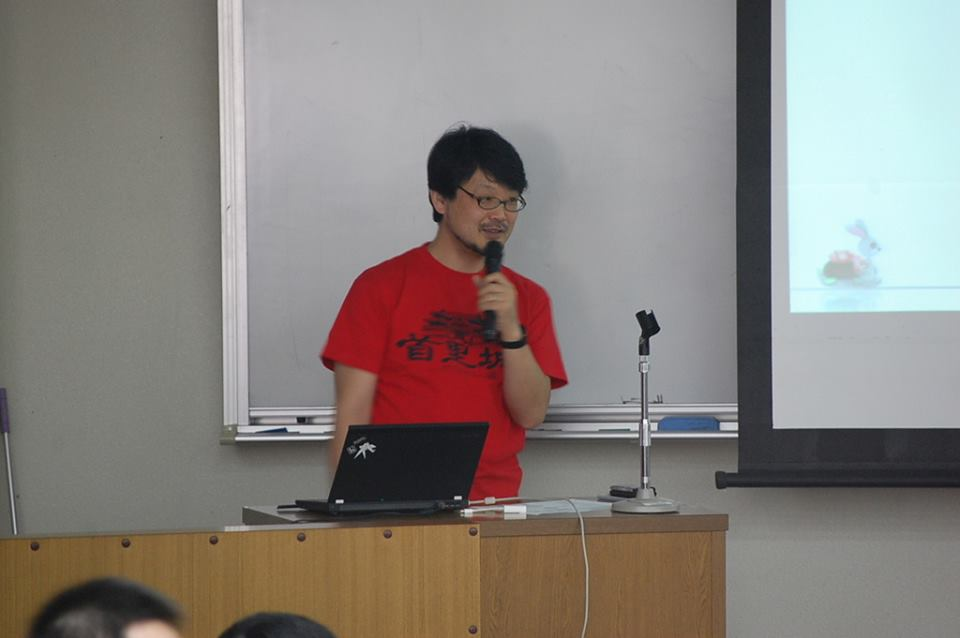

初沖縄のまつもとさん、首里城がプリントされたTシャツを着て登壇されました。発表前には沖縄にある炭酸飲料、ルートビアの話をなさったりと、沖縄を満喫されたようでした。会場は満員で立ち見が出るほどでした。

前夜祭のときから、「すごくエモい話をしようと思っている」とおっしゃっていましたが、本当に大変エモい話でした。

まず「世界はソフトウェアで動いている」と、まつもとさんから見た世界の話をされていました。

そこから「ガリレオ温度計のように、みんな固有の魂の浮力をもっている」、「魂の浮力がちょうどいいところにいるときに幸せになれる」といった話にはじまり、
スーツで出社する会社にジーンズで出社したら誰も何も言わなかったこと、自らがロシア語の関数名やコメントで困った経験から、日本語のドキュメントを英語でも書いたことなど、まつもとさんが自ら自分の世界を変えてきた話をされていました。

最後には「あなたはあなたの世界を変えることができる」、「勝手にルールを変えることで幸せになる」とおっしゃり、僕たちが変えられないと思っている世界は意外と変えられるよ、というメッセージが伝わってきました。

上記の動画のリンクは、途中までしか録画されていません。

当日話を聞けなかった方は、来場者のブログからまつもとさんの話のエモさが伝わってくるかもしれませんね。

- [沖縄Ruby会議01に参加しました| Little Braver](http://little-braver.com/366/)
- [「沖縄Ruby会議０１」に参加してきたよ？ - uranariのブログ](http://uranari.hatenablog.com/entry/2014/03/02/030546)


## ゲスト講演2

* 動画
  * [ゲスト講演「Rubyを使って3人/日でアプリをリリースしよう」part1](http://www.ustream.tv/recorded/44347244)
  * [ゲスト講演「Rubyを使って3人/日でアプリをリリースしよう」part2](http://www.ustream.tv/recorded/44347759)

### 「Rubyを使って3人/日でアプリをリリースしよう」

* 発表者
  * [@masuidrive](https://twitter.com/masuidrive)

* 資料
  * なし


風呂グラマーとして有名な@masuidriveさん。[wri.pe](https://wri.pe/)を作る過程、ローンチ後の運用部分などのお話を伺いました。「自分が普段使うものを作ろう」と、メモアプリであるwri.peの基本機能を3日で実装したそうです。プレスを打つ、運用、顧客対応などの広い範囲を経験できたことから、何か小さなものでもいいからプロダクトを作ってみることを薦めていました。

※沖縄Ruby会議実施後にwri.peのソースコードが公開されたようです。[wri.peのソースコードを公開しました。 | @masuidrive blog](http://blog.masuidrive.jp/2014/03/31/open-wri-pe/)


## Lightning Talks 1 + Sponsored Session

* 動画
  * [Lightning Talks 1 + Sponsored Session (各10分)](http://www.ustream.tv/recorded/44348324)

### 「Rubyによるバッチ業務のストリーム処理化の設計と実装」

* 発表者
  * [@bash0C7](https://twitter.com/bash0C7)

* 資料
  * [Rubyによるバッチ業務のストリーム処理化の設計と実装](https://speakerdeck.com/bash0c7/design-and-implement-batch-stream-processing-application-for-ruby)
  * [沖縄Ruby会議01 #okrk01 に参加した - その1. アドバイザーとは - @bash0C7. hatenablog.entries.reverse_each](http://bash0c7.hatenablog.com/entry/2014/03/03/005628)
  * [沖縄Ruby会議01 #okrk01 に参加した - その2. 発表してきた - @bash0C7. hatenablog.entries.reverse_each](http://bash0c7.hatenablog.com/entry/2014/03/21/003206)
  * [沖縄Ruby会議01に行ってきました。発表してきました。 #okrk01 - pixiv engineering blog](http://inside.pixiv.net/entry/2014/03/20/154535)


ログ収集ツールとして注目される[fluentd](http://fluentd.org)を使い、バッチ業務をストリーム処理化する手法を紹介して頂きました。
通常はログ収集のみにつかわれることが多いfluentdですが、入出力のプラグインを自作することで解析されたwebストリームを受けて進捗確認のツールとして使用することが出来るそうです。
プラグインは[RubyGem](https://www.ruby-lang.org/ja/libraries/)の形式で導入することが出来るため、手軽に機能を追加出来るとおっしゃっていました。

### 「Emacsの普通の使い方」

* 発表者
  * [@libkinjo](https://twitter.com/libkinjo)

* 資料
  * [Emacsの普通の使い方](http://kinjo.github.io/okrk01/#/title)


Rubyではirbやpryを使って対話式にプログラムを記述することが出来ますが、@libkinjoさんはEmacsのscratchバッファでelispと対話するようにRubyとも対話したいと考えました。
comint.elとinf-ruby.elを使ってEmacsバッファ内でRubyのコードを実行し、結果を受け取るデモを実際に動かして頂きました。

「scratchバッファはEmacsと対話する聖域（サンクチュアリ）」や「Emacsはロマンの積み木」などカッコいい名言で会場を盛り上げて頂きました。

###「RyukyuFrogsとLexues Academyの話」

* 発表者
    * 山崎さん([株式会社レキサス](http://lexues.co.jp))

* 資料
    * なし


沖縄Ruby会議のスポンサーをしていただいた[株式会社レキサス](http://www.lexues.co.jp/)の山崎さんから、沖縄県内の学生を育成するプロジェクト[RyukyuFrogs](http://www.ryukyu-frogs.com)と[Lexues Academy](http://academy.lexues.co.jp)をご紹介していただきました。後述する学生LT枠では2つの育成プロジェクトに参加した学生たちも登壇していました。

## 沖縄県内のコミュニティ活動の紹介

動画: [県内コミュニティ活動の紹介 (各3分〜5分)](http://www.ustream.tv/recorded/44349362)

沖縄のRubyコミュニティだけでなく、県内で活動するコミュニティ紹介のLTも行いました。
ものづくりのコミュニティから、エンジニアの集うシェアハウスまでの計5つのコミュニティの発表を行いました。
ここでは各コミュニティのリンク、当日の発表資料、発表者を紹介します。

### [Ryukyu Rubyist Rookies](https://www.facebook.com/groups/ruby.okinawa/)

* 発表者
  * [@repserc](https://twitter.com/repserc)

* 資料
  * [Ryukyu Rubyist Rookies 紹介 @ 沖縄Ruby会議01](http://www.slideshare.net/repserc/ryukyu-rubyist-rookies)

  * [沖縄Ruby会議で発表できなかったこと](http://repserc.hatenablog.com/entry/2014/03/04/164535)

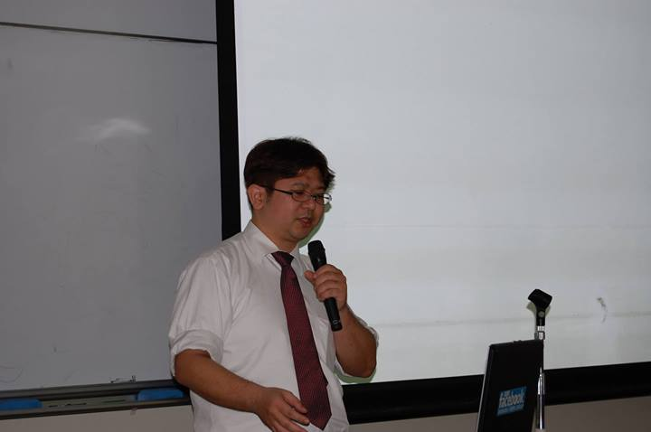


### [Ryudai.rb](http://lingr.com/room/ryudairb)

* 発表者
  * [@_simanman](https://twitter.com/_simanman)

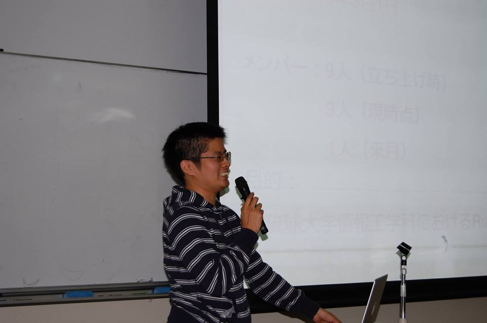

### [Okinawa.rb](https://www.facebook.com/groups/okinawarb/)

* 発表者
  * [@yasulab](https://twitter.com/yasulab)

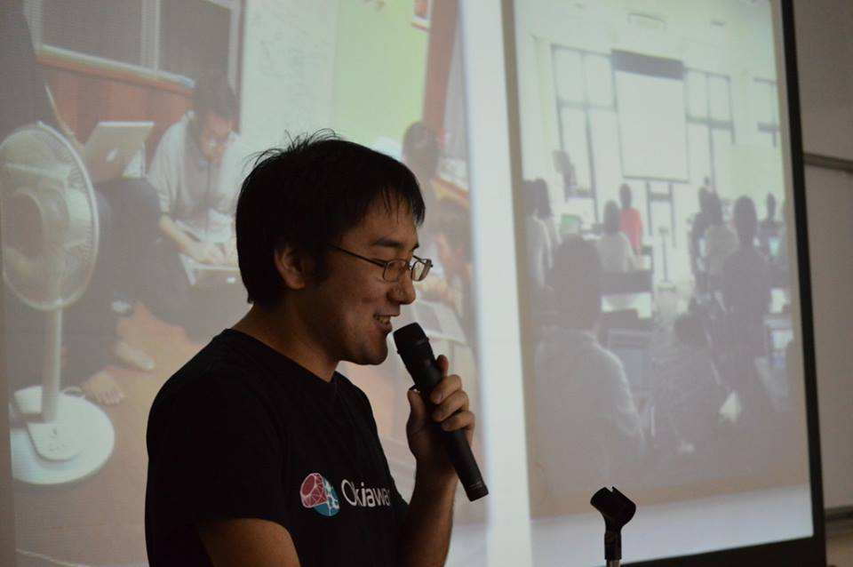


### [ハッカーズチャンプルー](http://hackers-champloo.org/)

* 発表者
  * [@k_nishijima](https://twitter.com/k_nishijima)

* 資料
  * [20140301ハッカーズチャンプルー告知lt](http://www.slideshare.net/KoichiroNishijima/20140301lt)
  * [K Nishijimaのぶろぐ: 沖縄Ruby会議とMusic Atlas 2014に行ってきました](http://k-nishijima.blogspot.jp/2014/03/rubymusic-atlas-2014.html)

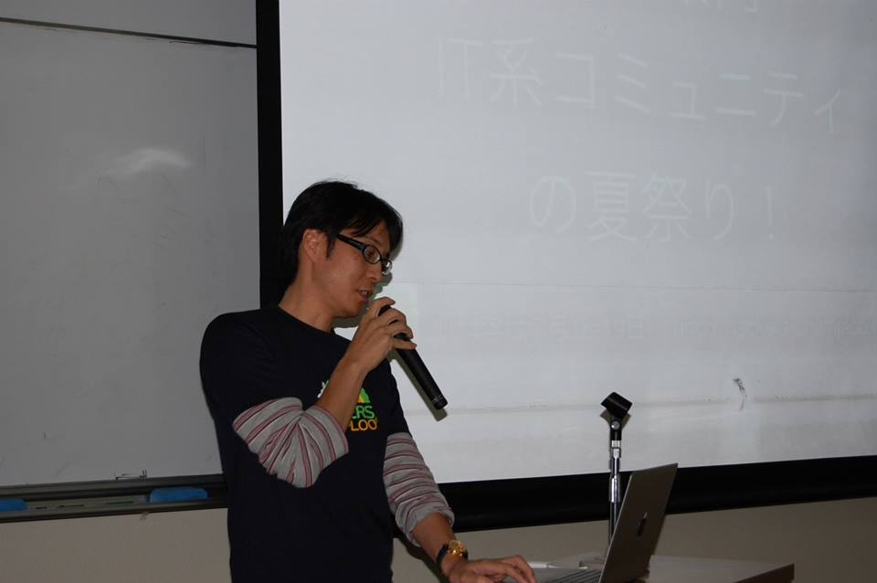


### [ギークハウス沖縄](http://text.geeoki.com)

* 発表者
  * [@kimihito_](http://twitter.com/kimihito_)

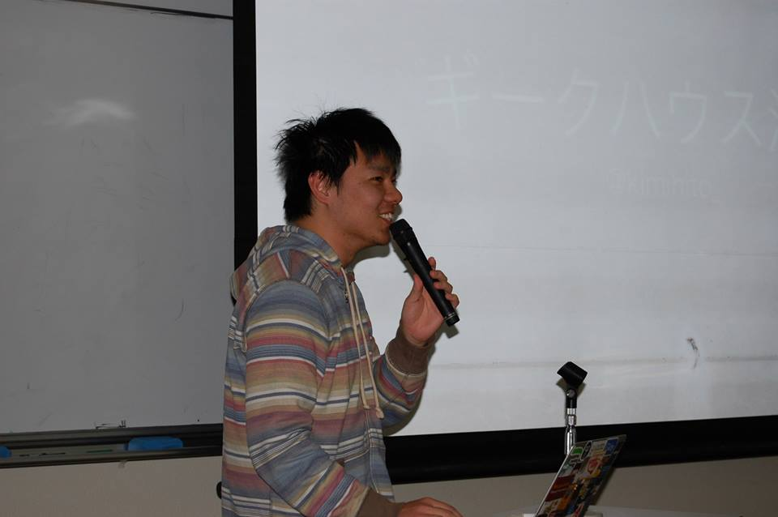


### gFab

* 発表者
  * 又吉さん

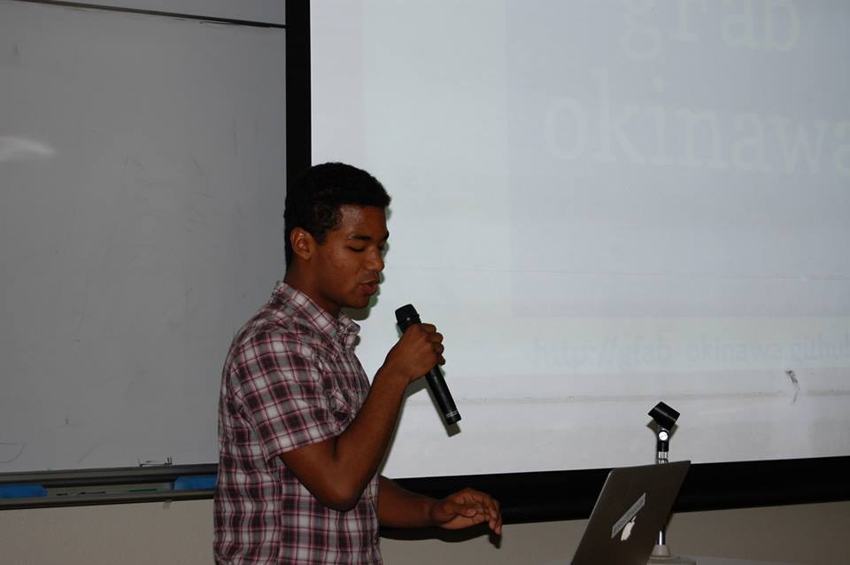


## Lightning Talks 2

* 動画
  * [Lightning Talks 2 (各10分)](http://www.ustream.tv/recorded/44350011)

### 「rcairoでものづくり」

* 発表者
    * [@mgwsuzuki](https://twitter.com/mgwsuzuki)

* 資料
    * [rcairoでものづくり](http://www.slideshare.net/mgwsuzuki/ruby-kaigi-rcairo)


2Dグラフィックス用のCライブラリである[cairo](http://cairographics.org/)をRubyでバインディングした[rcairo](https://github.com/rcairo/rcairo)を使って、自動設計するプログラムをRubyで作成、1時間20分ほどで完成することができたそうです。今後はGithubに自動設計のプログラム公開し、パラメータをPull Requestすることで簡単にハコを作れるようにしたいとおっしゃっていました。


### 「Rubyに何かをしゃべらせる」

* 発表者
    * [Yoichi Kobayashi](http://www.linkedin.com/pub/yoichi-kobayashi/89/205/461)

* 資料
    * なし


[Twilio](http://www.twilio.com/)とRubyを使って、ただひたすらオヤジギャクを喋らせる番号を取得したが、喋るオヤジギャクが本当に面白いものなのかというのをどう判定するかのアルゴリズムをRubyで考えたいというようなお話でした。オヤジギャクを扱いながらも、何をもって面白いのかを真面目に考察する発表に会場からは笑いが起こっていました。


### 「組み込みにもiOSにもrubyで幸せ（仮）」

* 発表者
    * [@shumach217](https://twitter.com/shumach217)

* 資料
    * [組み込みにもiOSにもrubyで幸せ（仮）](http://www.slideshare.net/shumach217/ruby01-31912722)


組み込みで行われる実機テストを、手作業からRSpecとturnipを使った自動化に変更したお話から、iOSの開発においても同様なアプローチができるのではないかと考え、turnipを記述でiOSのデバイスをリモート操作できるようなテストフレームワークを作成中であるとおっしゃっていました

## Lightning Talks 2.5 + Sponsored Session

### 「きたのくにからこんにちぬー！」

* 発表者
  * [@PUPRL](https://twitter.com/PUPRL)

* 資料
  * [きたのくにからこんにちぬー](http://www.slideshare.net/AsamiImazu/okrk01-kitanokunikarakonnnichinu)

* 動画
  * [「きたのくにからこんにちぬー！」part1](http://www.ustream.tv/recorded/44351500)
  * [「きたのくにからこんにちぬー！」part2](http://www.ustream.tv/recorded/44351537)


北海道からお越しの[@PUPRL](https://twitter.com/PUPRL)さんは、「和室でぬるくRubyをもくもくする」[ぬRuby](http://nuruby.org/)という活動の紹介の地域Rubyに参加することの良さについて語ってくださいました。はじめてのLTであったにも関わらず、ぬRubyの魅力がしっかり伝わったようで、LT後にはぬRubyに参加したいとの言葉をたくさん見受けることができました。


### 「The Payment System by Ruby」ウェブペイ株式会社

* 発表者
  * [@sowawa](https://twitter.com/sowawa)

* 資料
  * なし

* 動画
  * [「The Payment System by Ruby」](http://www.ustream.tv/recorded/44351293)


開発者向けのクレジット決済サービスの[WebPay](https://webpay.jp/)を開発しているウェブペイ株式会社のスポンサーセッションでは、Rubyでセキュアなプログラミングを行う際の注意点をお話してくださりました。シンボルはGCされない問題があり、ユーザ入力をto_symすると問題が起きてしまうという例を取り上げ、シンボルの扱いに関してのお話がありました。5分という短いセッションながらも内容の濃いお話でした。


## Lightning Talks 学生枠

学生を募集対象としたLT枠も設け、計6名学生が登壇しました。

* 動画
  * [Lightning Talks 学生枠 (各5分)](http://www.ustream.tv/recorded/44351656)

### 「This is a SharePla」

* 発表者
    * [@kanpe777](https://twitter.com/kanpe777) [@salvare234](https://twitter.com/salvare234)
    * [RyuPiT](https://github.com/RyuPiT)


旅のプランをネット上で共有出来るWebアプリケーション[SharePla](http://sharepla.herokuapp.com)を紹介しました。
人材育成イベントの一環でアジャイル開発のスクラムを実践したらしく、実際にどのようにWebアプリケーションを開発していったかを話していました。
Web上にも公開していて実用したユーザのフィードバックを受けて開発を続けていきたいと話していました。

### 「琉大図書館にRuby本を！」

* 発表者
    * [@_simanman](https://twitter.com/_simanman)

* 資料
    * [琉大図書館にRuby本を！](http://www.slideshare.net/_siman/ruby-31905851?qid=8ca58c70-4301-47df-b498-d2daa3e917c4&v=qf1&b=&from_search=1)


琉球大学図書館の選書システムを自動で入力する自作スクリプトについて紹介しました。プレゼンが可愛い棒人間で書かれていて目で見て面白いLTでした。

### 「#MacFriends: Macの背面にステッカーを貼るヤツちょっとこい」

* 発表者
    * [@enkw_](https://twitter.com/enkw_)

* 資料
    * [#MacFriends: Macの背面にステッカーを貼るヤツちょっとこい](https://speakerdeck.com/enkw/number-macfriends-in-okinawa-ruby-kaigi)


[enkw_](https://twitter.com/enkw_)さんはMac Bookの背面をシェアするユニークなサービス[Mac Frends](http://macfriends.net)を紹介しました。
[RubyFriends](http://rubyfriends.com)から着想を得て作成したらしいです。会場ではさっそく利用している方の姿もありました。

### 「Square your Instagram」

* 発表者
    * [@nanophate](https://twitter.com/nanophate)


[instag](http://instag.herokuapp.com)は美術館のように洗練されたデザインで写真を閲覧することのできるサービスです。
開発をおこなった[nanophate](https://twitter.com/nanophate)さんは従来の写真公開サービスを見て「いいね」や「スター」などに邪魔されず、もっとユーザーが写真に没頭できるようなデザインのがほしいと思ったそうです。
画像は[instagram](http://instagram.com)の[API](http://instagram.com/developer/)を使って取得していてサービス名もそこから来ているらしいです。

### 「Rubyがモデリングをする時代」

* 発表者
    * [@motikan2010](https://twitter.com/motikan2010)


手軽に世界に一つだけのものを作れるサービス[Once-Tech](http://once-tech.net)について[motikan2010](https://twitter.com/motikan2010)さんが紹介しました。
既存の3Dモデルとユーザーがアップロードした画像を組み合わせることで自分だけの3Dモデルが作れるそうです。
発表で実際にサービスを利用してオリジナルの3Dモデルを作成するデモを行っていましたが数十秒ほどで3Dモデルが完成し、本当に手軽に利用することが可能でした。

## Lightning Talks 3

* 動画
  * [Lightning Talks 3 (各5分)](http://www.ustream.tv/recorded/44352072)

### 「RubyKaigiの話」@kakutani
* 発表者
    * [@kakutani](https://twitter.com/kakutani)

* 資料
    * [All About Ruby-no-Kai in Okinawa RubyKaigi 01 // Speaker Deck](https://speakerdeck.com/kakutani/all-about-ruby-no-kai-in-okinawa-rubykaigi-01)


[日本Rubyの会](http://ruby-no-kai.org/)から来た[@kakutani](https://twitter.com/kakutani)さん。
まずはじめに、一番大事なこととして、今年の9/18〜9/20に行われる[RubyKaigi 2014](http://rubykaigi.org/2014)と、
間を開けず来年4/9〜4/11日に行われる[RubyKaigi 2015](http://rubykaigi.org/2015)の告知をしてくださいました。

日本Rubyの会ではRubyistの活動を支援しており、[るびま](http://magazine.rubyist.net/)や[るりま](http://docs.ruby-lang.org/ja/)、[Regional RubyKaigi](http://regional.rubykaigi.org/)、[Rails Girls](http://railsgirls.jp/)などの開催の支援しているそうです。

最後に、大事なのは活動、みなさんがコミュニティだ、ということで、沖縄で続けていってほしいとおっしゃっていました。

沖縄には

- [Ryukyu Rubyist Rookies](https://www.facebook.com/groups/ruby.okinawa/)
- [Okinawa.rb](https://www.facebook.com/groups/okinawarb/)
- [ryudai.rb](http://lingr.com/room/ryudairb)
- [Hackers Champloo](http://hackers-champloo.org/)
- gFab
- [ギークハウス沖縄](http://text.geeoki.com/)

の他にもたくさんコミュニティがあります。

[沖縄IT勉強会カレンダー](https://sites.google.com/site/nmtysh/okinawa-it-seminar-calendar)に直近の勉強会やコミュニティの情報がたくさん載っているので、みなさん、沖縄で会いましょう
!


### 「るびまの話」@gunjisatoshi

* 発表者
    * [@gunjisatoshi](https://twitter.com/gunjisatoshi)

* 資料
    * なし

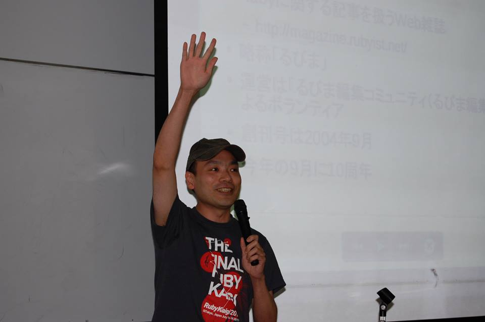

沖縄のRubyistもお世話になっている、[Rubyist Magazine](http://magazine.rubyist.net/)、略称「るびま」のおはなし。
なんと今年の9月に10周年になるそうです。

- Rubyist Magazineの編集プロセス
- あなたにも出来る貢献

についてお話してくださいました。

進捗管理は[GitHub Issues](https://github.com/rubima/rubima/issues)をWatchすると編集部がどんなことをやっているか
見ることが出来るらしいです。早速Watchしました!

- 記事を読んでフィードバックを送る
- 記事を投稿する
- 企画の提案をする
- システム(Hiki)の不具合を直す
- 編集者コミュニティへ参加する

などなどいろいろな貢献方法があるそうです。

### 「1 個の Pull Request の Diff を 200 行以下にしたら捗った話」@kbaba1001

* 発表者
    * [@kbaba1001](https://twitter.com/kbaba1001)

* 資料
    * [Pull RequestのDiffを200行以下にしたら捗った話 // Speaker Deck](https://speakerdeck.com/kbaba1001/pull-requestfalsediffwo200xing-yi-xia-nisitarabu-tutahua)

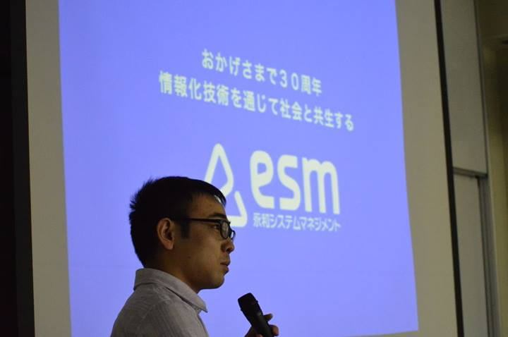

[@kbaba1001](https://twitter.com/kbaba1001)さんの小さいPR最高!!話でした。
小さいPull Requestだと、毎日PRが出せて楽しい、レビューの質があがる、マージ速い!と楽しそうに語っていました。
部分的にPullRequestを出すコツを具体的に挙げられていたので、すごく参考になりました。

### 「カスタムマッチャーを流行らせたい」@moro

* 発表者
    * [@moro](https://twitter.com/moro)

* 資料
    * [Suggestion-for-RSpec-Custom-matcher // Speaker Deck](https://speakerdeck.com/moro/suggestion-for-rspec-custom-matcher)

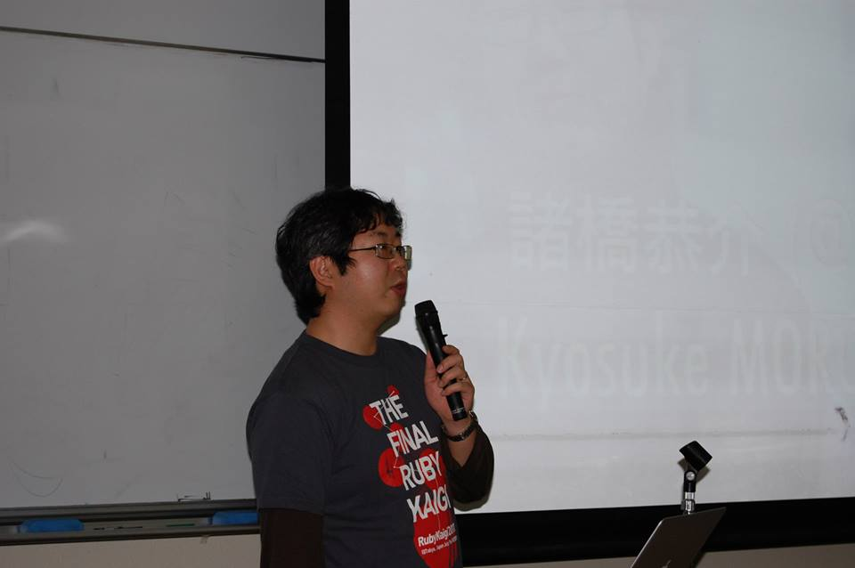

RSpecのカスタムマッチャーで、アプリケーションロジックをテストするための語彙を作ると、アプリケーションロジックをテストしやすくなる!楽しくなる!という話でした。

真偽値を返す`match`を書くだけで簡単にカスタムマッチャーが定義出来るので、積極的に使っていきたいですね。

``` ruby
RSpec::Matchers.define(:matchers_name) do |expected|
  match do |actual|
    actual == expected
  end
end
```

### 「1,000,000yen Salesforce1 Platform Mobile Hack Challenge」@ayumin

* 発表者
    * [@ayumin](https://twitter.com/ayumin)

* 資料
    * なし

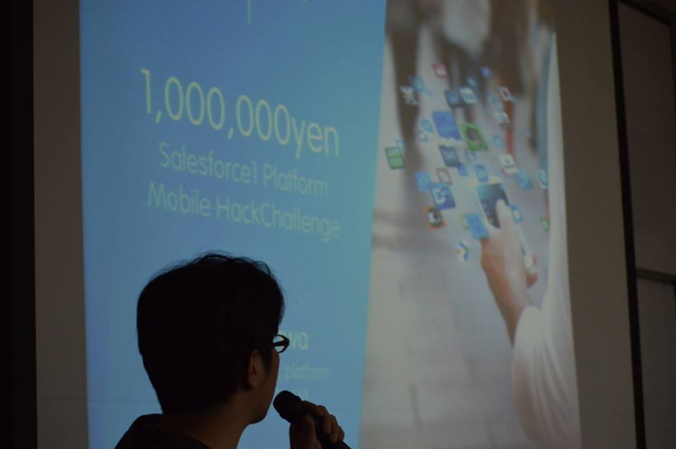

るびまに掲載される頃には応募が終了しているかもしれませんが、[
Salesforce1 Platform モバイル開発チャレンジ](http://events.developerforce.com/ja/contests/challengejapan2014)の開催告知でした。

## ゲスト講演3

* 動画
  * [ゲスト講演 「mrubyを使うポイント」](http://www.ustream.tv/recorded/44352699)

### 「mrubyを使うポイント」

* 発表者
    * [田中 和明 准教授](http://www.kyutech.ac.jp/professors/iizuka/i4/i4-2/entry-714.html)


2012年4月にgithubにコードが公開されて以来、オープンソースでの開発がすすむ軽量rubyこと[mruby](http://www.mruby.org/)。
そのmrubyを使うポイントについて講演していただきました。

組み込み開発では主にCが常用されていますが、Rubyの方がコードを書きやすいのはCでプログラムを書いたことがある方ならすぐに分かりますね。

mrubyは当初から組み込みシステムに使われることを目的にスタートしました。

Rubyの実行速度は遅いと言われていますが、かと言って実行速度が速ければいいというわけではなく、一定時間内に処理が完了することを保証するリアルタイム性を満たすことができれば、組み込みのシステム開発でmrubyを使ってコードを書くことができます。

mrubyではRubyの強みであるGCを使ったメモリ管理とリアルタイム性を両立するため、GCの処理が一定時間以内に完了する「インクリメンタルGC」を採用しているとのことでした。

mrubyの大きな強みとしてあげられるのが、VMプログラム上で動作するということです。

mrubyのコードはRiteBinaryと呼ばれるバイトコードに変換され、各ハードウェアで動作するVMプログラムへ渡すことでプログラムを実行することができます。
そのため一度VMプログラムを作ってしまえば、PC上で動作するmrubyプログラムも、マイコン上で動作するmrubyプログラムも、全く同じコードで動かすことが可能となります。

また田中先生が大学で行っている研究として、mrubyに特化したハードウェアの開発の紹介がありました。
研究の例としてmrubyのメソッド呼び出し時に頻繁に使われるハッシュ関数をLSIチップ上で実装し、文字列操作を行うプログラムの性能を20%上昇させることに成功したとのことでした。

実際にデモを交えながらの講演の様子は、上記の動画リンクでも見ることが可能です。

